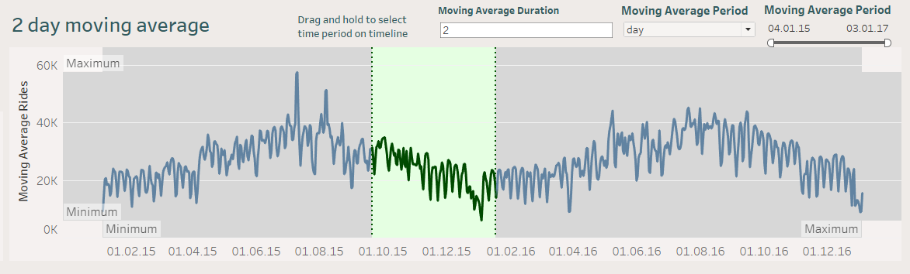
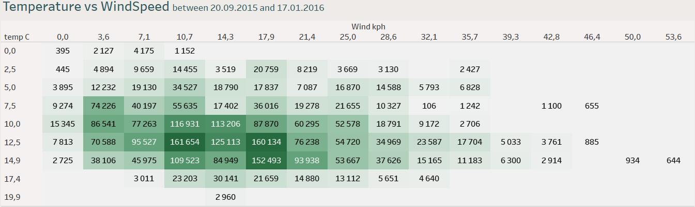

# Аналіз Поїздок на Велосипедах у Лондоні

## Огляд Проєкту

🌟 Цей проєкт аналізує поїздки на велосипедах у Лондоні за період з 2015 по 2017 рік, щоб дослідити ключові патерни, сезонні тренди та вплив екологічних факторів на використання велосипедів.

---

## Джерело Даних
Цей проект використовує дані, надані [Transport for London (TfL) Open Data] (https://tfl.gov.uk/info-for/open-data-users/).

### Основні Характеристики:
- **Часовий період:** Січень 2015 – Січень 2017.
- **Змінні:**
  - Реальна температура, швидкість вітру, вологість.
  - Розподіл поїздок за сезонами та святковими днями.
  - Кількість поїздок за днями.

### Приклад Даних:
Нижче наведено зразок набору даних:


---

## Використані Інструменти та Технології
- **Python**: Для очищення, підготовки та аналізу даних.
- **Tableau**: Для створення інтерактивних візуалізацій та інформаційних панелей.
- **Jupyter Notebook**: Для документування та виконання Python-скриптів.
- **Git і GitHub**: Для контролю версій та спільного використання проєкту.

---

## Очищення та Аналіз Даних

### Зразок Кодового Фрагмента
Нижче наведено фрагмент коду на Python, що використовувався для очищення та попередньої обробки даних:

```python
import pandas as pd

data = pd.read_csv('london_bikes_final.csv')
data['real_temp'] = data['temp_real_C'].fillna(data['temp_real_C'].mean())
data['ride_count'] = data['count']
data['is_weekend'] = data['is_weekend'].astype(bool)
data_cleaned = data.dropna()
```
### Приклад результату:

```text
Average temperature: 12.47°C
Average rides per hour: 1,143
Optimal temperature range: 10–22°C
```

## Ключові візуалізації

### Інформаційна панель Tableau

Дослідіть інтерактивну інформаційну панель Tableau для детальної візуалізації:
[Інформаційна панель велопрогулянок у Лондоні](https://public.tableau.com/app/profile/kateryna.zahrebina/viz/LondonBikeRides_17377457774600/Dashboard1)

### Зразки візуалізації

1. **Дводенне ковзне середнє для поїздок на велосипеді:**

 

2. **Теплова карта залежності температури від швидкості вітру:**

 

## Статистика

### Загальна та середня кількість поїздок:
- **Загальна кількість зареєстрованих велосипедних поїздок:** 19 905 972.
- **Середня кількість поїздок на велосипеді за годину:** 1143.

### Погодні та екологічні умови:
- **Середня температура:** 12,47°C.
- **Середня швидкість вітру:** 15,91 км/год.
- **Середня вологість:** 72,3%.

### Сезонні тренди:
- Велосипедні прогулянки були найбільшими влітку (6 424 609 поїздок), потім восени (5 073 040), навесні (4 850 236) і взимку (3 558 087).

### Вплив вихідних і святкових днів:
- **Несвяткові будні:** 14 752 718 поїздок.
- **Вихідні:** 4 857 756 поїздок.
- **Канікули:** 295 498 поїздок (відносно низький вплив).

### Вплив температури:
- **Оптимальний діапазон:** 10–25°C, пік особливо близько 12,5–22,4°C.
- Надзвичайно низькі (< 5°C) або високі (> 27°C) температури значно зменшують кількість поїздок.

### Вплив швидкості вітру:
- **Оптимальний діапазон:** 0–21 км/год. Значне падіння вище 25 км/год.
- Дуже висока швидкість вітру (> 39 км/год) призводить до мінімальних поїздок на велосипеді незалежно від температури.


---
## Висновки

- **Вплив сезону**: влітку використовується найбільше велосипедів, що вказує на сприятливі погодні умови та довший світловий день.
- **Температура**: оптимальні умови для їзди на велосипеді – 10–22°C, що відповідає м’якій та приємній погоді.
- **Швидкість вітру**: мінімальний вплив на низьких швидкостях, але значно зменшує використання велосипеда вище 25 км/год.
- **Свята**: низька активність у свята може вказувати на те, що менше людей їздять на роботу

## Майбутні вдосконалення

1. Покращте аналіз, включивши інші фактори, як-от час доби чи громадські події.
2. Оптимізуйте візуалізацію для більш чіткого розуміння.
3. Впроваджуйте моделі машинного навчання для прогнозування майбутнього використання велосипеда.
---